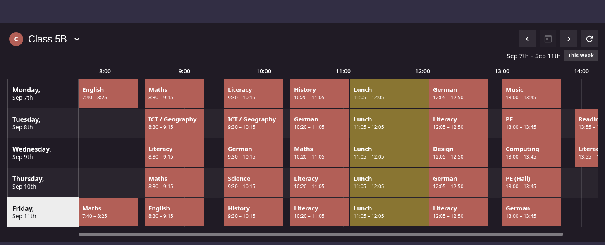
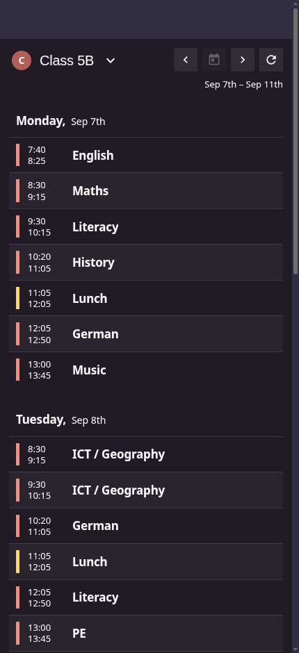

# Simple Schedule Card

A Home Assistant Lovelace card that draws a **whole week** of calendar events as a
proportional timetable — days down the left, hours across the top.

It was written because every stock and HACS calendar card shows "the next N days" from
right now. On a Wednesday they cannot show you Monday, which is exactly what a school
timetable on a kitchen tablet is for.



On a narrow screen it falls back to a day-grouped list:



## What's in it

- **The current week, always.** Monday is still on screen on Friday afternoon. Arrows step
  to any other week and a button returns to this one.
- **A proportional axis.** Blocks are sized and positioned by their real start and end, so
  a 45-minute lesson and a two-hour club are visibly different, and the gaps between them
  are real gaps. Irregular period boundaries — 07:40, 08:30, 09:30, 10:20 — need no
  configuration.
- **A uniform lattice.** Any hour band occupies the same pixels in every row, and an empty
  Friday is exactly as tall as a busy Monday. The lane count is resolved once for the whole
  week and applied to every day alike, so one crowded morning never leaves the other days'
  blocks twice as thick.
- **Several people's calendars**, switched from the heading, each with its own avatar,
  colour and time axis.
- **Colours that match Google**, including per-event colours, which no calendar card can
  show on its own — see [Colours](#colours).
- **Push updates.** Events arrive over `calendar/event/subscribe`, so the grid reflects a
  change as soon as Home Assistant knows about it. Nothing polls.
- A detail sheet on tap.
- **Read-only.** Creating and editing events is not implemented.

## Requirements

| | |
|---|---|
| Home Assistant | 2024.4 or newer (`calendar/event/subscribe`) |
| Calendar | Any `calendar.*` entity — Google, Local Calendar, CalDAV, … |
| Per-calendar colour | HA 2026.2+ stores one automatically for calendars registered after that release. Older ones fall back to a built-in palette. |

## Install

**HACS** — add this repository as a custom repository of type **Dashboard**, install, then
add the resource `/local/simple-schedule-card/dist/simple-schedule-card.js` as a JavaScript
module.

**Manual** — copy `dist/simple-schedule-card.js` into `config/www/` and register it under
*Settings → Dashboards → Resources*.

## Usage

The minimum:

```yaml
type: custom:simple-schedule-card
entity: calendar.school
orientation: days-as-rows
```

A school timetable with a sibling's on the same card:

```yaml
type: custom:simple-schedule-card
orientation: days-as-rows
entities:
  - entity: calendar.alex_school
    person: person.alex
  - entity: calendar.sam_school
    person: person.sam
  - entity: calendar.family
    person: person.jo
    calendar_mode: full
    view_width_mode: adaptive
time_format: '24'
```

## Options

| Option | Type | Default | Description |
|---|---|---|---|
| `type` | string | **required** | `custom:simple-schedule-card` |
| `entity` | string | – | A single calendar. Shorthand for a one-item `entities`. |
| `entities` | list | – | One or more calendars. Each is either an `entity_id` string or the object below. Wins over `entity` when both are given. |
| `orientation` | `days-as-columns` \| `days-as-rows` | `days-as-columns` | Which axis the days run along. `days-as-rows` is the printed-timetable shape and the one everything below is tuned for; `days-as-columns` is the calendar shape, days across the top and time down the left. |
| `days` | `auto` \| `mon-fri` \| `mon-sun` | `auto` | Which days are drawn. `auto` draws Mon–Fri and adds **both** weekend days as soon as either has an event. The card always fetches the full seven. |
| `day_start` | `HH:MM` \| `auto` | `07:00` | Start of the time axis. `auto` uses the week's earliest event exactly, applied to every day together. Ignored under `calendar_mode: full`. |
| `day_end` | `HH:MM` \| `auto` | `15:00` | End of the time axis. `auto` uses the week's latest event. |
| `hour_width` | number | `192` | `days-as-rows`: pixels per hour. Sized so a 45-minute block holds about 16 characters. |
| `day_height` | number | `72` | `days-as-rows`: pixels per lane within a day's row. |
| `hour_height` | number | `84` | `days-as-columns`: pixels per hour. |
| `lane_mode` | `by_source` \| `packed` | `by_source` | How a day is divided into lanes — see below. |
| `time_format` | `auto` \| `12` \| `24` | `auto` | `auto` follows Home Assistant's own setting. Pin it to `24` for a timetable without changing the rest of the frontend. |
| `show_refresh` | boolean | `true` | Show the refresh button. |
| `layout` | `auto` \| `grid` \| `list` | `auto` | `auto` picks by the card's own measured width. |
| `layout_breakpoint` | number | `560` | Width in px below which `auto` uses the list. |
| `event_colors` | map | `{}` | Colour by event title, e.g. `Lunch: '#f4c542'`. Matched case-insensitively on the whole summary. An explicit override that beats everything, including the colour helper. |
| `min_contrast` | number | `4.5` | Minimum contrast between a block's fill and its white label; lighter fills are darkened until they pass. `3.5` for a brighter grid, `0` to use Google's palette untouched. |
| `color_helper` | boolean \| string | `true` | Use the per-event colours published by the pyscript helper. `false` ignores it; a string points at a different path. |

Each entry in `entities`:

| Option | Type | Default | Description |
|---|---|---|---|
| `entity` | string | **required** | A `calendar.*` entity id. |
| `person` | string | – | A `person.*` whose picture becomes the calendar's avatar. |
| `calendar_mode` | `focused` \| `full` | `focused` | `focused` fits the time axis to that calendar's own events. `full` draws the whole day, midnight to midnight, and opens scrolled to the first event. |
| `view_width_mode` | `fixed` \| `adaptive` | `fixed` | `fixed` gives every hour `hour_width` pixels, so a block of a given length looks the same on any screen and the grid scrolls when the day is wider than the card. `adaptive` fits the whole span into the card, so nothing scrolls. `days-as-rows` only. |

There is deliberately **no `name`** and **no `color`** per calendar. Both come from Home
Assistant, and the colour helper keeps them in step with Google.

The two per-calendar modes combine freely:

| | `fixed` | `adaptive` |
|---|---|---|
| **`focused`** | the school-timetable default: constant block widths, scrolls past the edge | the week squeezed into the card, no scrolling |
| **`full`** | the whole day at full size — a lot of scrolling, every hour legible | the whole day at a glance, hours compressed to fit |

### The calendar is the heading

Avatar, the calendar's own name and — with more than one configured — a chevron, all one
button. There is no separate card title. The name comes from Home Assistant and cannot be
overridden; renaming in Google reaches the card through the helper. Words are capitalised
the way Google lists them, leaving acronyms and apostrophes alone.

**One calendar is shown at a time.** All configured calendars are subscribed to, so
switching is instant. The time axis and the weekend rule are scoped to whichever calendar is
on screen, so one calendar's early start cannot rescale another's grid — and
`calendar_mode`/`view_width_mode` are per calendar for the same reason: a timetable and a
household calendar want different shapes.

The picture lives on the **person**, not on a Home Assistant user — a person can have one
without having a login at all — so `person:` points at a person even for someone who can
sign in. Without it, the avatar is the first letter of the calendar's name on the calendar's
own colour.

Opening the menu, or an event's detail sheet, dims the schedule and folds the blocks away
behind it; closing replays the week's entry animation.

### `lane_mode`

Grouping is by **source calendar** — never by the event's title, and never by how close two
events are in time. Give each kind of activity its own calendar entity and the card does the
rest.

- **`by_source`** (default) gives every configured calendar its own lane inside every day,
  present whether or not it has anything that day. Gymnastics is reliably the same stripe on
  every row. A calendar that overlaps *itself* — a class split into two groups at the same
  hour — sub-divides its own lane, and every other calendar is given the same subdivision so
  the grid stays even.
- **`packed`** pools all calendars into one set of lanes that appear only where events
  genuinely overlap. Denser, but a given calendar is not always in the same place.

Back-to-back events are a *sequence*, not an overlap: 08:30–09:15 followed by 09:30–10:15,
and exactly abutting ones like 11:05–12:05 then 12:05–12:50, share one lane. Only genuine
overlap adds a lane.

### Colours

A calendar's colour is read automatically from the entity registry, where Home Assistant
stores the `backgroundColor` Google reports for that calendar.

**Per-event colours need the optional helper.** If you paint one event yellow in Google
Calendar, that colour never reaches any card on its own: Google returns a `colorId` on every
event and the underlying library parses it, but `_get_calendar_event()` in the `google`
integration copies only eight fields into Home Assistant's `CalendarEvent`, and colour is not
one of them — the dataclass has no colour field. Every calendar card has this limitation.

Home Assistant does still *persist* that colour with the synced event, it simply offers no
way to read it. `pyscript/simple_schedule_colors.py` reads it back out of that store and
publishes it for the card, so blocks match Google one-to-one. See **The colour helper**
below.

If you would rather not run it, either name the event in `event_colors`, or give the
activity its own calendar — a separate `calendar.*` entity carries its own colour and, with
`lane_mode: by_source`, gets its own lane.

### The colour helper

Optional. Requires [pyscript](https://github.com/custom-components/pyscript).

1. Symlink (or copy) `pyscript/simple_schedule_colors.py` into `<config>/pyscript/`.
2. `pyscript.reload`, then call `pyscript.simple_schedule_colors_sync` once.
3. It writes `<config>/www/simple-schedule-card-data/event-colors.json`, refreshing at
   startup and every 15 minutes — the same interval the Google integration itself syncs on,
   so nothing is gained by going faster.

It also keeps each **calendar's** own colour and **name** in step with Google. Home Assistant
copies both once, when the calendar entity is first registered, and never looks again — so
recolouring or renaming a calendar in Google otherwise has no effect. The helper lists the
calendars through the integration's own authenticated service and writes any change into the
entity registry, which is the field both this card and Home Assistant's own calendar panel
read. Turn it off with `simple_schedule_colors_sync_calendars: false`.

Every hex value comes from Google. The helper calls `colors.get`, which returns both the
calendar and the event palette, so nothing is hardcoded — which matters, because Google only
returns a true `backgroundColor` when the request sets `colorRgbFormat=true` and the
underlying library never does. Calendars on a stock palette colour therefore report their
palette *index* (`#00000a` is id 10, not near-black), and the palette resolves it.

Event colours themselves are read from the local store with no API call. A full run is about
a second, most of which is the two palette/calendar-list requests; the event pass over ~3,500
events is ~150 ms of that.

Note that blocks will not look identical to Google. Google puts **dark** text on its fills;
this card uses white, so fills are darkened to keep the label readable — see `min_contrast`.
Raise or lower that to taste.

Google's web UI also darkens its palette in dark mode, so a colour eyedroppered off your
screen will not match the API's value either. Override any colour id if you want the
on-screen shade:

```yaml
pyscript:
  simple_schedule_colors_palette:
    "5": "#e7ba51"    # Banana, as the dark-mode UI paints it
```

### Freshness

Events are pushed over a WebSocket subscription, so anything Home Assistant already knows
appears immediately — nothing polls.

Google's calendar coordinator serves reads from a cache it refreshes every 15 minutes, so an
edit made in Google is not in Home Assistant at all until then. The **refresh button** drives
the whole chain rather than just re-reading: it calls `homeassistant.update_entity` to start
the poll at once, waits for it to land, asks the colour helper to republish, then
re-subscribes and re-reads the colours. A press takes a few seconds and picks up an edit made
in Google seconds earlier.

## Design rules

The card is read from across a room, and that drove most of what it looks like:

- It sits on the theme's own `--ha-card-background`, not on a translucent panel.
- **No grey text.** Importance is carried by size and weight only.
- **Square.** No `border-radius` anywhere.
- **Blocks are opaque**, at the calendar's true colour, with white labels — the fill is
  darkened when white would not read on it, rather than the label changing colour.
- **No today or now markers** in the grid. The card shows a week, flat. (The list marks the
  current day, where there is no column to read it from.)
- Nothing is ever inferred: no glosses, translations or keyword icons. The card renders what
  the calendar says.

## Development

```bash
npm install
npm run typecheck
npm test          # vitest over the pure modules in src/data
npm run build     # single-file ESM bundle into dist/
```

`dist/simple-schedule-card.js` is **committed** so the repo installs through HACS with no
build step. CI rebuilds on every push and warns if the committed bundle has gone stale.

See [CLAUDE.md](CLAUDE.md) for the architecture and the decisions behind it.

## Licence

MIT.
